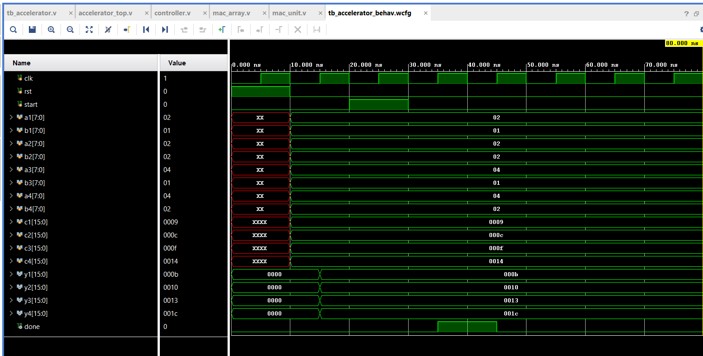
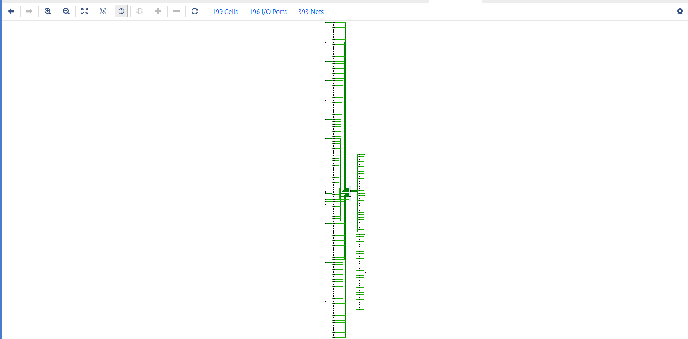
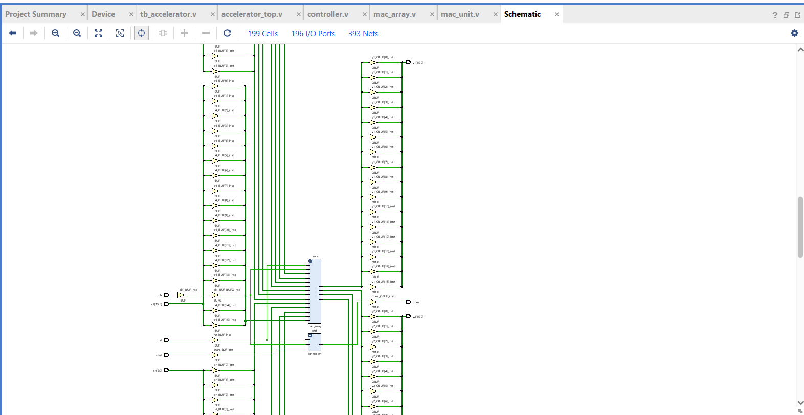

# GPU-Inspired Parallel AI/ML Hardware Accelerator using Verilog HDL

## Project Overview

This project implements a GPU-inspired parallel hardware accelerator using Verilog HDL in Xilinx Vivado. The architecture is based on multiple MAC (Multiply-Accumulate) units operating in parallel to accelerate AI/ML style computations such as matrix operations.

The design consists of:

- Clocked MAC processing elements
- Parallel MAC array for simultaneous computation
- FSM-based controller for control flow
- Top-level integrated accelerator module

The project was functionally verified through behavioral simulation and synthesized to observe gate-level hardware mapping.

---

## Design Flow

1. Designed a clocked MAC unit using Verilog HDL  
2. Built a parallel MAC array by instantiating multiple MAC units  
3. Implemented FSM controller (IDLE → COMPUTE → DONE)  
4. Integrated complete accelerator architecture  
5. Verified functionality using testbench simulation  
6. Synthesized the design in Vivado and analyzed gate-level netlist  

---

## Tools Used

- Verilog HDL
- Xilinx Vivado 2025.1
- Behavioral Simulation
- RTL Synthesis

---

## Key Features

- Parallel MAC computation
- GPU-inspired architecture
- FSM-based control
- Hardware acceleration for AI/ML workloads
- RTL-to-Gate synthesis flow

---

## Project Files

- `mac_unit.v` → Basic MAC processing element
- `mac_array.v` → Parallel MAC compute array
- `controller.v` → FSM controller
- `accelerator_top.v` → Top-level integration
- `tb_accelerator.v` → Testbench for verification

---

## Behavioral Simulation Waveform

---

## Synthesized Hardware Schematic

### Top-Level Schematic

### Netlist-Level Schematic

---

## Interview Summary

This project demonstrates practical knowledge in:

- RTL Design
- Parallel Hardware Architecture
- FSM Design
- Functional Verification
- Synthesis Flow
- Hardware Resource Analysis
